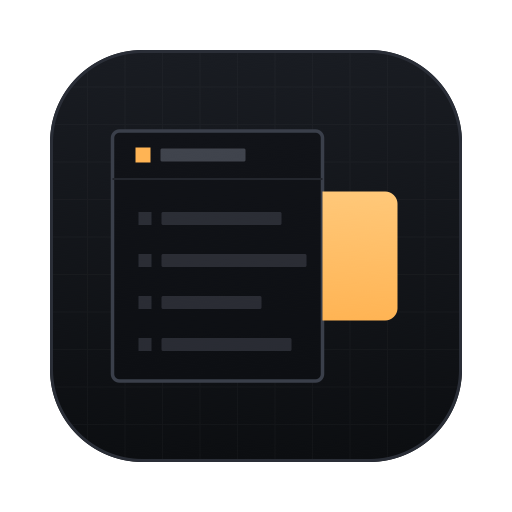

# Notchboard - Shared test accounts, docked to your simulator

Notchboard is a macOS menu-bar app that keeps your team's working test logins next to the simulator
you are already looking at. It attaches a slim notch to the edge of the iOS Simulator or Android
emulator window, follows that window as it moves, and opens into a searchable catalogue on a click.
Pick an account, copy it or fire it straight into the booted app as a deeplink, and mark it "in use"
so nobody logs in behind you.

There is no backend. The app is local-first, teams that want live sharing join an
end-to-end-encrypted room on an MQTT broker of their choosing, and updates come straight from this
repository's releases page.

<h4 align="center">
  <a href="https://github.com/thepearl/notchboard/actions/workflows/ci.yml">
    
  </a>
  
  
  <a href="https://thepearl.github.io/notchboard/">
    
  </a>
</h4>

<p align="center">
  
</p>

<p align="center">
  
  <br />
  <sub>The panel docked to the Simulator window. That account's login is one click away, through the deeplink shown at the foot of the demo app.</sub>
</p>

## Install

```bash
brew install --cask thepearl/tap/notchboard
```

The download is signed and notarised, so the first launch is a double click. It keeps itself up to
date from the releases page. There is no Dock icon, so look for the square in the menu bar. No
Homebrew? Grab `notchboard-<version>.zip` from the
[latest release](https://github.com/thepearl/notchboard/releases/latest) instead.

## 📚 Documentation

**Everything lives at [thepearl.github.io/notchboard](https://thepearl.github.io/notchboard/documentation/)**:

[Getting started](https://thepearl.github.io/notchboard/documentation/getting-started/quickstart/),
day-to-day use, [team rooms](https://thepearl.github.io/notchboard/documentation/guides/team-rooms/),
the [security model](https://thepearl.github.io/notchboard/documentation/guides/security-model/),
every setting and shortcut, the [FAQ](https://thepearl.github.io/notchboard/help-center/), and the
[integration reference](https://thepearl.github.io/notchboard/integration/) for the deeplink, export
and invite formats. The site is built from this repo's `website/` folder on every push to master, so
the two never drift.

For working on Notchboard itself: [CONTRIBUTING.md](CONTRIBUTING.md) covers building and testing,
[CLAUDE.md](CLAUDE.md) the load-bearing constraints (each with the bug behind it),
[vision.md](vision.md) the product specification and implementation log,
[ROADMAP.md](ROADMAP.md) what is next, and [ABOUT_AI_USAGE.md](ABOUT_AI_USAGE.md) the terms for AI
assistance, which is encouraged.

## Building from source

```bash
git clone https://github.com/thepearl/notchboard.git
cd notchboard
xcodebuild -project notchboard.xcodeproj -scheme notchboard -configuration Debug build
```

Xcode 26 or later, no Apple account needed - signing is ad-hoc, so a fresh clone builds and runs
as-is. A copy you build yourself never checks for updates. Docking needs the Accessibility
permission, and a self-built copy must re-grant it after every rebuild;
[the installation guide](https://thepearl.github.io/notchboard/documentation/getting-started/installation/)
has the detail.

## 🤝 Contributing

Contributions are welcome, in code, docs, bug reports and ideas. Read
[CONTRIBUTING.md](CONTRIBUTING.md) for how to build, test and open a pull request, browse the
[open issues](https://github.com/thepearl/notchboard/issues) for something to work on, and please
read the [code of conduct](CODE_OF_CONDUCT.md). Starring the repo is the easiest way to help other
people find it. ⭐

## Licence

Apache-2.0. See [LICENSE](LICENSE). Third-party components and their licences are in
[THIRD-PARTY-NOTICES.md](THIRD-PARTY-NOTICES.md).

# Thanks to everyone who has helped

<a href="https://github.com/thepearl/notchboard/graphs/contributors">
  
</a>
