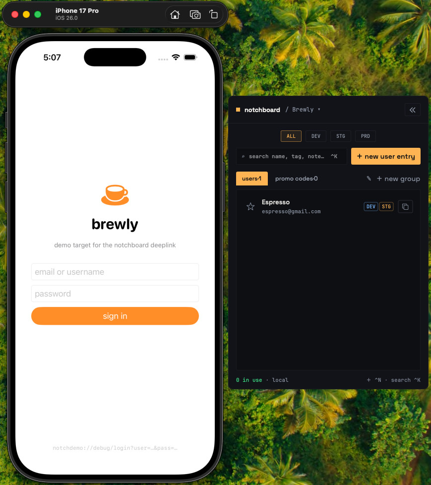
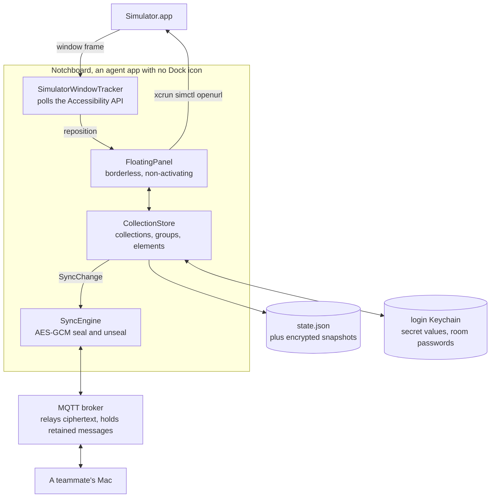

# Notchboard - Shared test accounts, docked to your iOS Simulator

### 📚 [Read the documentation at notchboard.gitbook.io/notchboard](https://notchboard.gitbook.io/notchboard/documentation)

Notchboard is a macOS menu-bar app that keeps your team's working test logins next to the simulator
you are already looking at. It attaches a slim notch to the edge of the Simulator window, follows
that window as it moves, and opens into a searchable catalogue on a click. Pick an account, copy it
or fire it straight into the booted app as a deeplink, and mark it "in use" so nobody logs in behind
you.

There is no backend. The app is local-first, and teams that want live sharing join an
end-to-end-encrypted room on a broker of their choosing.

**Works with Xcode, Simulator, and a standard MQTT 5 broker** - or with nothing at all, if you keep
it local.

<h4 align="center">
  <a href="https://github.com/thepearl/notchboard/actions/workflows/ci.yml">
    
  </a>
  
  
  <a href="https://notchboard.gitbook.io/notchboard">
    
  </a>
</h4>

<p align="center">
  
</p>

<p align="center">
  
  <br />
  <sub>The panel docked to the Simulator window. That account's login is one click away, through the deeplink shown at the foot of the demo app.</sub>
</p>

<!-- A screen recording of the notch following the window as it moves belongs here. Drag the file
     into a GitHub issue or release, then paste the user-attachments URL on its own line. -->

## Table of contents

- [Main use cases](#main-use-cases)
- [Main features](#main-features)
  - [Platform support](#-platform-support)
- [Every action, and where it lives](#-every-action-and-where-it-lives)
- [Architecture](#️-architecture)
- [Documentation](#-documentation)
- [Prerequisites](#prerequisites)
- [Installation and configuration](#installation-and-configuration)
  - [Verify it works](#-verify-it-works)
  - [Team room mode](#team-room-mode)
  - [How to use](#️-how-to-use)
  - [Example workflows](#-example-workflows)
- [Running and configuration](#running-and-configuration)
  - [Settings](#settings)
  - [Where your data lives](#where-your-data-lives)
  - [Security and privacy](#security-and-privacy)
- [What it is not](#-what-it-is-not)
- [Roadmap](#-roadmap)
- [Contributing](#-contributing)
- [Licence](#licence)

### Main use cases

Where the minutes actually go, and what replaces them:

- 🔑 Finding the staging account that still works, without scrolling a pinned Slack message.
- 🙋 Seeing that a teammate is already on it, before you log in and kick them out.
- ⚡ Getting into the app without retyping a password on a simulator keyboard.
- 🧪 Keeping promo codes, test cards, seeded users and deeplinks in one place per project.
- 🤝 Onboarding someone on their first morning by sending one line instead of six.

## Main features

- 🎯 **Docked, not another window to manage**: the panel tracks the real Simulator window through the
  Accessibility API and moves with it. It never steals focus, because it is a non-activating panel,
  so you can type in its search field while Simulator stays frontmost.
- 👥 **In-use marks other people see**: mark an account in use and everyone in the room sees who took
  it and when. It releases itself after an idle window you set, so a forgotten mark is not permanent.
- 🚀 **One-click login on the simulator**: fires `<scheme>://debug/login?user=…&pass=…` into the
  booted app through `xcrun simctl openurl`, with a separate copy-password button for the SSO and
  WebView screens a deeplink cannot drive.
- 🔒 **End-to-end encrypted, with no backend of ours**: every room payload is sealed with AES-GCM
  under a key derived from the room password. The broker relays bytes it cannot read, and you pick
  the broker.
- 📇 **A catalogue, not a notes file**: several collections, editable group schemas, seven field
  types, environments per element, favourites, search and keyboard navigation.

### 🎯 Platform support

| Target | Supported | Setup |
|---|:---:|---|
| macOS 14 and later | ✅ | Build from source, Xcode 26 or later |
| Docking to the Simulator | ✅ | Simulator.app running, plus the Accessibility permission |
| One-click login | ✅ | A booted simulator, a URL handler in your app, the scheme set on the collection, and a `username` field |
| Team room | ✅ | An MQTT 5 broker with retained messages, including a local `mosquitto` |
| Physical iOS device | ⚠️ | Copy and paste only, `simctl` cannot reach a real device |
| Android or emulators | ❌ | Not supported, and not planned |
| Mac App Store build | ❌ | Impossible by design, the App Sandbox breaks docking |

## 🔧 Every action, and where it lives

### Menu bar

- **`Toggle Expand / Collapse`** - Flips between the notch and the full panel
- **`Show Panel (Undocked)`** - Shows the panel free-floating and draggable, and outranks docking. The same item then reads `Dock to Simulator Again`
- **`Join Room with Invite`** - Paste an invite line and a room password to join a teammate's room
- **`Export Collection`** - Writes the active collection to a password-protected `.notchboard` file
- **`Import Collections`** - Adds one or more files as new collections, destroying nothing
- **`Restore Snapshot`** - Replaces all collections from an encrypted local snapshot
- **`Settings`** - Opens the settings window
- **`Quit Notchboard`** - Quits, releasing the global chords and flushing state to disk

### Collection menu, the ▾ next to the collection name

- **`<collection name>`** - One row per collection, with a checkmark on the active one
- **`new collection`** - Creates an empty catalogue with one seeded group and switches to it
- **`rename`** / **`duplicate`** - Duplicating mints fresh element ids, so secrets do not alias
- **`set deeplink scheme`** - The URL scheme one-click login fires into, stored per collection
- **`set up team room`** - Broker URL, room name, room password. Once joined, the item shows the room and its connection state
- **`copy room invite`** - Puts the one-line invite on the pasteboard. Only shown once a room exists
- **`join with an invite`** - The other side of that, shown only when the collection has no room
- **`leave room`** - Keeps everything local and stops sending and receiving
- **`delete`** - Removes the collection and its secrets. Disabled when it is the last one

### The element list

- **`search`** - Case-insensitive match over name, note and every field value in the active group
- **`environment filter`** - Four chips, `ALL` `DEV` `STG` `PRD`, single-select
- **`favourite`** - A star per row. Local only, it never travels to a room
- **`group tabs`** - One tab per group with its count, plus editing and adding

### An element

- **`use + copy`** - Marks it in use by you and copies the first field, concealed if that field is secret
- **`copy password`** - Copies the password alone without touching the in-use mark
- **`login on sim`** - Fires the deeplink into the booted app, then marks the element in use if it succeeded
- **`take over from <name>`** - Takes an element someone else holds. It lives in the detail view, because pulling the account out from under a teammate should not be a stray click in the list
- **`notify when free`** - A macOS notification when the holder releases it

### Keyboard

- **`⌃K`** - Opens the panel with the search field focused. Global
- **`⌃N`** - Opens the add-element form. Global
- **`↑` `↓`** - Move through the list, scrolling the highlighted row into view
- **`Return`** - Opens the highlighted element
- **`Esc`** - Goes back to the list from a detail, add or group screen
- **`⌘,`** - Opens settings, and works even during onboarding

The two global chords share one modifier, settable to `⌃`, `⌘` or `⌥⌘`. Inside the panel, plain `⌘K`
and `⌘N` always work whatever the global modifier is.

"Global" is scoped rather than absolute, and deliberately so. The chords are claimed only while Xcode,
Simulator or Notchboard is frontmost, and only while the panel is in a state to respond. Everywhere
else they go straight back to the system, which is what makes `⌃K` an acceptable default at all,
since it is `kill-line` in your shell and `deleteToEndOfParagraph:` in every Cocoa text view.

## 🏗️ Architecture



The Accessibility permission is used for exactly one thing, reading Simulator's window frame. When it
is missing, or Simulator is not running, the menu bar still opens the panel as an ordinary floating
window. That is the supported fallback, not a broken state.

## 📚 Documentation

The hosted documentation lives at [notchboard.gitbook.io/notchboard](https://notchboard.gitbook.io/notchboard). Its Documentation section is generated from the `docs/` folder of this repo on every push to master, so the two never drift. The in-repo pages:

| Page | What is in it |
|---|---|
| [INSTALL.md](INSTALL.md) | Building, granting Accessibility, troubleshooting a first launch |
| [USAGE.md](USAGE.md) | Day-to-day use, hosting and joining a room, which brokers work |
| [ROADMAP.md](ROADMAP.md) | What is next, what is an accepted limit, what is not planned |
| [CONTRIBUTING.md](CONTRIBUTING.md) | Building, testing, and what a pull request needs |
| [ABOUT_AI_USAGE.md](ABOUT_AI_USAGE.md) | Using an AI assistant here, which is encouraged, and on what terms |
| [docs/RELEASING.md](docs/RELEASING.md) | Signing, notarisation, and the Homebrew cask |
| [vision.md](vision.md) | The product specification, with the implementation log in section 13 |
| [CLAUDE.md](CLAUDE.md) | The load-bearing constraints, each with the bug behind it |

## Prerequisites

- [macOS 14.0](https://support.apple.com/en-us/109033) (Sonoma) or later.
- [Xcode 26](https://developer.apple.com/xcode/) or later. This one is measured rather than guessed.
  The project sets `SWIFT_DEFAULT_ACTOR_ISOLATION = MainActor`, which Xcode 16 ignores instead of
  rejecting, so the build fails on the first implicitly main-actor initialiser rather than on the
  setting itself.
- An iOS simulator, for the docked presentation and one-click login. The app is fully usable without
  one, undocked, from the menu bar.
- The Accessibility permission, in System Settings, Privacy and Security, Accessibility. Reading
  another app's window frame is exactly what that permission gates.
- An [MQTT](https://mqtt.org/) broker, only if you want a team room. Anything speaking MQTT 5 works,
  from a local `mosquitto` to a free hosted tier.

No Apple developer account is needed. Signing is ad-hoc with an empty development team, so a fresh
clone builds and runs as-is.

## Installation and configuration

**Standard route** is Homebrew:

```bash
brew install --cask thepearl/tap/notchboard
```

The download is signed with a Developer ID certificate and notarised by Apple, so the first launch
is a double click, not a Gatekeeper fight. The tap prefix is there because a bare
`brew install notchboard` needs acceptance into homebrew-cask, whose notability criteria this
project does not meet yet.

Without Homebrew, download `notchboard-<version>.zip` from the
[latest release](https://github.com/thepearl/notchboard/releases/latest), unzip it, and drag
`notchboard.app` into Applications. Same notarised build, same result.

The app has no Dock icon, so look for the square in the menu bar.

<details>
<summary>Building from source</summary>

```bash
git clone https://github.com/thepearl/notchboard.git
cd notchboard
open notchboard.xcodeproj
```

Press Run, or from the command line:

```bash
xcodebuild -project notchboard.xcodeproj -scheme notchboard -configuration Debug build
```

The built app lands in Xcode's DerivedData. To find it:

```bash
xcodebuild -project notchboard.xcodeproj -scheme notchboard -configuration Debug -showBuildSettings | grep -m1 BUILT_PRODUCTS_DIR
```

Copy `notchboard.app` out of that directory into `/Applications`. Expect to re-grant Accessibility
after moving it, because the grant is bound to the path.

</details>

<details>
<summary>Granting Accessibility</summary>

Open System Settings, then Privacy and Security, then Accessibility. Add `notchboard.app` and switch
it on.

An installed release keeps the grant across updates, because every release is signed with the same
Developer ID identity. A self-built copy does not: its signature is ad-hoc, which means it is the
binary hash, so every rebuild is a different app as far as macOS is concerned. Remove the old entry
with the minus button and add the new build.

</details>

<details>
<summary>Teaching your app to accept a login deeplink</summary>

One-click login sends `<scheme>://debug/login?user=<encoded>&pass=<encoded>` to the booted
simulator. Your app's debug build needs the URL scheme registered and a handler that reads the query.

`SampleApp/` in this repo is a working example you can install into a simulator to try the bridge
before touching your own project.

One thing decides whether the button appears: the element needs a non-empty field keyed `username`.
The password sent is the value of the group's first secret-typed field.

The collection's scheme is checked when you press it, not when it is drawn. Without one, the button
still appears, captioned "no URL scheme yet", and pressing it tells you where to set it.

</details>

### ✅ Verify it works

Start Simulator.app, then open the panel from the menu bar.

You should see a slim notch attached to the edge of the Simulator window, following it as you drag
that window around. Click the notch and the catalogue opens.

If no notch appears, Accessibility is the first thing to check. If it still does not appear, the menu
bar item opens the panel undocked, and everything except docking works from there.

### Team room mode

By default nothing leaves your Mac. A collection joins a room only when you tell it to.

The host sets the room up once, then picks `copy room invite` and sends that one line however they
like. Joiners paste it into `join with an invite` and type the room password. That is the whole
flow, one line and one password. The broker's retained messages then hand the new joiner the entire
catalogue, with no history protocol of our own.

The room password is shared out of band, like a wifi password. It never travels inside an invite or
an export file. The invite is not a secret in the same way, but it is not public either: it carries
the broker address, port, account username and room name in readable form, with only the broker
account password sealed inside it. Treat it like an internal link.

Joining an existing room is destructive on first connect. The room's catalogue replaces whatever
that collection held locally, including its Keychain secrets, because the room is the source of
truth once you are in it. A local snapshot is forced immediately before, and that snapshot is the
only undo. Join with a fresh collection when you have anything you want to keep.

<details>
<summary>What your broker has to support</summary>

Notchboard leans on more of MQTT 5 than a chat app would, so "speaks MQTT" is not quite the bar.

- MQTT 5.0. There is no 3.1.1 fallback.
- Retained messages, and enough of them. The retained set is the room's entire state, one message
  per group, per element, per live in-use mark and per member.
- QoS 1, in both directions.
- Wildcard subscriptions, plus publish and subscribe permission on `nb/<room>/#`.
- The `noLocal` subscription option, and overlapping subscriptions kept distinct rather than merged.
- Last Will and Testament with retain, which is how a Mac that dies ungracefully stops holding its
  marks.
- The Message Expiry Interval property, used only to age out deletion tombstones.

Mosquitto, HiveMQ and EMQX all qualify. A managed broker with a low retained-message quota or a
restrictive topic ACL will fail in ways the app can only report as a generic connection problem.

</details>

<details>
<summary>Local mosquitto, for trying it out</summary>

```bash
brew install mosquitto
"$(brew --prefix)"/opt/mosquitto/sbin/mosquitto -p 1883
```

Then use `mqtt://localhost:1883`. TLS is not required on localhost and no broker account is needed.
This is also what the integration tests expect.

</details>

<details>
<summary>A hosted broker with an account</summary>

Brokers like HiveMQ Cloud give you a URL plus a username and password. The host types that broker
password once, at room setup. It is then sealed under the room key and travels inside the invite as
ciphertext, so joiners never see it and never type it.

Three URL shapes are accepted, and anything else is refused at connect rather than silently
downgraded:

| Scheme | When |
|---|---|
| `mqtts://host[:8883]` | The normal case, TLS over TCP |
| `wss://host[:443][/path]` | MQTT over WebSocket and TLS, for a corporate firewall that blocks 8883 |
| `mqtt://localhost[:1883]` | Loopback only, plaintext |

TLS is mandatory for anything that is not localhost. A plaintext `mqtt://` pointed at a real host is
refused with a message telling you to use `mqtts://`.

TLS trust comes from the system store and cannot be customised. A self-hosted broker with a
self-signed or private-CA certificate does not work, because there is no code path for adding a
trust anchor.

</details>

<details>
<summary>A public test broker</summary>

Public brokers need no account, which makes them the fastest way to see a room running. Everything
Notchboard publishes is sealed, but the room name, your group names and the traffic timing are
visible to anyone watching that broker.

Use one for a trial with throwaway data, never for anything you care about.

</details>

### 🛠️ How to use

The panel is built around one loop. Find the account, take it, get into the app.

Search filters as you type. Arrow keys move through the list and Return opens an element. From there
you can copy any field, copy the password on its own, fire the login deeplink, or mark the account in
use.

Marking something in use is what makes this a team tool rather than a list. Everyone in the room sees
who took it and when, and it releases itself after the idle window if you forget.

### ✨ Example workflows

**Grab the staging account and get into the app**

```
⌃K              opens the panel with the search field focused
type "staging"  filters as you type
↓ then Return   opens the account
"use + copy"    marks it in use and copies the first field
"login on sim"  fires the deeplink into the booted app
```

**Set up a room and invite the team**

```
collection ▾ → "set up team room"
   broker URL, room name, and a generated room password
collection ▾ → "copy room invite"
   paste that one line into your team chat
   send the room password separately, out of band
```

**Join a team on your first morning**

```
open Notchboard for the first time
onboarding → "join a team room"
   paste the invite line a teammate sent
   type the room password they sent separately
the whole catalogue arrives from the room
```

**Add a test user that everyone gets**

```
⌃N                     opens the add-element form
pick the group         its schema decides the fields
fill them in           validation runs at save, not as you type
tick DEV and STG       an element can sit in more than one environment
save                   it appears on everyone else's Mac
```

**Move a collection to another Mac without a room**

```
menu bar → "Export Collection"
   choose a destination, then set a file password (Generate is one click)
send the .notchboard file
on the other Mac, double-click it and type the password
```

## Running and configuration

### Settings

Open settings with `⌘,` from the panel, or from the menu bar item.

| Setting | What it does | Default |
|---|---|---|
| Start expanded when docking | Whether Notchboard comes up as the full panel or the notch at launch | on |
| Dock to | Which edge of the Simulator window the notch attaches to | Right edge |
| Auto-release in-use elements after N min idle | How long your own in-use mark survives before releasing itself. 5 to 240, in steps of 5 | 60 min |
| Global shortcut | The modifier both global chords use, `⌃`, `⌘` or `⌥⌘` | ⌃ Control |
| Play a sound with notifications | Whether a notify-when-free notification makes a sound | on |
| Launch at login | Starts Notchboard when you log in | off |
| Debug URL scheme | The scheme one-click login fires into, per collection | none |
| Warn before mixing production with another environment | Asks once, at save, when an element mixes `PRD` with anything else | on |

The team room section of the same window shows the room, its connection state and the number of
members online, with a button to leave or to join with an invite.

### Where your data lives

```
~/Library/Application Support/Notchboard/state.json   collections and settings
~/.notchboard/snapshots/                              encrypted snapshots
```

Secret-typed fields are replaced in `state.json` by a placeholder, and the real values live in the
login Keychain under three services:

- `flourix.notchboard.secrets` for secret field values.
- `flourix.notchboard.rooms` for room passwords.
- `flourix.notchboard.device` for the key that seals snapshots, which is why snapshots do not travel
  between Macs.

There is one deliberate exception. If a Keychain write fails, because the keychain is locked or the
write was denied, the value stays in `state.json` rather than being replaced by a placeholder
pointing at nothing. Losing a secret to a transient failure would be worse.

Snapshots are written at most every 15 minutes, piggybacked on a successful save, and the 24 newest
are kept. A `state.json` that cannot be decoded is moved aside to `state.json.corrupt` rather than
discarded, and the app tells you it happened.

To move a collection to another Mac, export it. The export password restores the secrets on the other
side. Copying `state.json` alone leaves secret fields empty, because the Keychain entries stay behind.

### Security and privacy

Read this before putting anything sensitive into a room or an export file.

Every room payload is sealed with AES-GCM under a key derived from the room password, through PBKDF2
at 600,000 rounds with a salt derived from the broker host and room name, then HKDF over the result
for domain separation from the export password. The broker
relays bytes it cannot read. Send the wrong room password and messages fail to open cleanly rather
than being applied as garbage.

The room password is the entire security boundary, and it is one key for the whole room. There are
no per-member keys and no roles. Anyone who has held that password can read every value in that
collection, secrets included, and keeps that ability after they leave, because rotating a room
password in place is refused: everything the broker retains is ciphertext under the old key, so
rotating would lock the room's own members out. Removing someone means creating a new room and
reinviting everyone else.

That is the opposite split from an export file, and the two are worth keeping straight. In a room,
everything in the payload is encrypted. In a file, only secret-typed values are.

Topic names are not encrypted. A broker operator sees the room name, your group names, the internal
ids of every element and member, exactly how many groups, elements, live in-use marks and members
exist, which element was taken and at what second, and who is online. On a public broker, so does
everyone else who cares to subscribe. Pick a room name that gives nothing away, and prefer a broker
you control.

The salt is derived rather than random, and retained messages sit on the broker indefinitely, so
anyone able to subscribe can collect ciphertext and grind the room password offline at their leisure.
The 600,000 rounds are what make that expensive. A weak room password is the one thing that undoes
all of it, which is why the dialog has a generator.

An export file protects secret-typed values only. Element names, usernames, notes, schemas and
environments are readable plaintext in the file. So is the room block, if the collection has one:
broker address, port, account username and room name, with only the broker account password as
ciphertext inside it.

In-use marks are stripped on export, but names are not. The collection carries a member list mapping
member ids to display names, learned from the room, and every element keeps the member id of whoever
last edited it. Both travel in the file in the clear. Strip them by hand if you are sending a
catalogue outside the team.

That plaintext is a deliberate trade-off, recorded in vision.md 13.9, because being able to open a
collection file and read it is worth the debuggability. The per-field lever is the field type. Mark a
field secret and its value moves into the encrypted envelope. A file is exactly as strong as the
password you gave it.

There is one place a password leaves the Keychain in the clear. `simctl` takes the deeplink URL as a
command-line argument, so while that short-lived process runs, a password in the query is readable by
other processes running as you. There is no argv-free way to hand `simctl` a URL. These are shared
test credentials on a local developer tool, so the exposure is documented rather than hidden, and
everything under the app's own control is redacted. See the header of
`notchboard/Docking/SimctlBridge.swift`.

Removing someone from a room means picking a new room name and a new room password, then sending a
fresh invite to everyone else. There is no server, so there is nobody to revoke them at.

None of this has had an external security review. It is a pre-release project, and the design
reasoning is written up in vision.md section 14 for anyone who wants to check the working.

## 🧩 What it is not

Knowing the edges beats finding them the hard way.

- **Not a password manager.** This holds shared test credentials for a team. Your personal secrets
  belong somewhere with a different threat model.
- **Not a production secrets store.** The app warns you when an element mixes production with another
  environment, and that warning is the whole mechanism. There is no policy engine behind it.
- **Not a simulator automation tool.** It fires one deeplink. Seeding fixtures, resetting device state
  and scripting flows are a different tool's job.
- **Not a service.** The broker is the only server, it only relays ciphertext, and you choose it.

## 🚀 Roadmap

A soft-delete trash, the lint burned down, and homebrew-cask acceptance once the notability numbers
are there.
[ROADMAP.md](ROADMAP.md) has the detail, including the limits that are accepted rather than pending,
and the short list of things that would justify building a backend.

## 🤝 Contributing

Contributions are welcome, in code, docs, bug reports and ideas.

- ⭐ **[Star the repo](https://github.com/thepearl/notchboard)**, the easiest way to help other people
  find it.
- Read [CONTRIBUTING.md](CONTRIBUTING.md) for how to build, test and open a pull request.
- Browse [open issues](https://github.com/thepearl/notchboard/issues) for something to work on.
- Read [CLAUDE.md](CLAUDE.md) before changing anything structural. Every constraint in it has a bug
  behind it.
- 🤖 Using an AI assistant is encouraged, especially on bug fixes.
  [ABOUT_AI_USAGE.md](ABOUT_AI_USAGE.md) has the terms.

Please also read the [code of conduct](CODE_OF_CONDUCT.md).

## Licence

Apache-2.0. See [LICENSE](LICENSE).

Third-party components and their licences are in
[THIRD-PARTY-NOTICES.md](THIRD-PARTY-NOTICES.md). The bundled fonts, Space Grotesk and JetBrains
Mono, are under the SIL Open Font License 1.1.

# Thanks to everyone who has helped

<a href="https://github.com/thepearl/notchboard/graphs/contributors">
  
</a>
