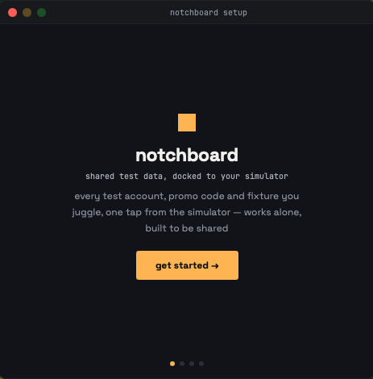
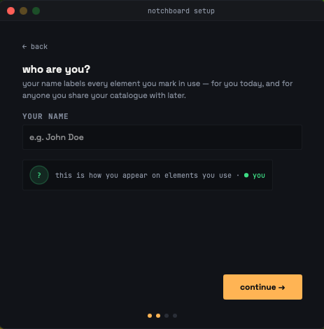

This quickstart gets the app running and docked as fast as possible. Configuration can wait until you have something on screen.

<Callout type="success">
**Estimated time: 5 minutes.** All you need is Homebrew and a simulator.
</Callout>

## Steps

<Steps>
<Step>
#### Install it

```bash
brew install --cask thepearl/tap/notchboard
```

The download is signed and notarised, so the first launch is a normal one. [Installation](./installation.mdx) covers the alternatives, a zip from the latest release or building from source.
</Step>

<Step>
#### Launch it

```bash
open /Applications/notchboard.app
```

Look for the half-filled square in the menu bar. There is no Dock icon.
</Step>

<Step>
#### Walk through setup

Four steps in their own window: a welcome screen, your name, your starting point, and the Accessibility permission.



*Setup runs in its own small window.*



*The name you give here labels every element you mark in use.*

For a first look, pick the sample catalogue. It comes with 4 groups and 20 elements to poke at.
</Step>

<Step>
#### Grant Accessibility

On the last setup step, click **grant access**. macOS shows its own dialog. Open System Settings, go to Privacy & Security then Accessibility, and turn the Notchboard switch on. The setup step polls in the background and flips to granted by itself.

<Callout type="info">
The system dialog is one-shot. Once you dismiss it, further clicks do nothing, which is why the button changes to **open System Settings** after the first attempt.
</Callout>

If the toggle will not stick, which happens on some managed Macs, click **continue without docking**. Everything works except docking, and you open the panel from the menu bar instead.
</Step>

<Step>
#### Verify it works

Start Simulator.app, then open the panel from the menu bar.

You should see a slim notch attached to the edge of the Simulator window, following it as you drag that window around. Click the notch and the catalogue opens.


*The expanded panel docked to a simulator, here running the repository's sample app.*
</Step>
</Steps>

## What's next?

<Cards>
  <Card href="./your-first-collection.mdx" title="Your first collection" />
  <Card href="../guides/team-rooms.mdx" title="Team rooms" />
  <Card href="../guides/the-deeplink-bridge.mdx" title="The deeplink bridge" />
</Cards>
