This is the path we recommend for most teams. Nothing to install, nothing to keep awake, TLS on by default, and a free tier that a room will never outgrow. The whole thing is about five minutes, and every screenshot below comes from one real run of it.

If you would rather run the broker yourself, that path is documented in [team rooms](./team-rooms.mdx) under hosting your own broker. Everything else about rooms (invites, presence, what syncs) also lives there. This page is only the broker and the first connection.

<Callout type="success">
HiveMQ never sees your data. Every payload Notchboard publishes is ciphertext under the room key, so the broker relays bytes it cannot read. The [security model](./security-model.mdx) has the full picture.
</Callout>

## Create the broker

<Steps>
<Step>
#### Sign up and start the wizard

Create a free account at [console.hivemq.cloud](https://console.hivemq.cloud). A fresh account lands on an empty network page. Pick **Get Broker or Edge**.

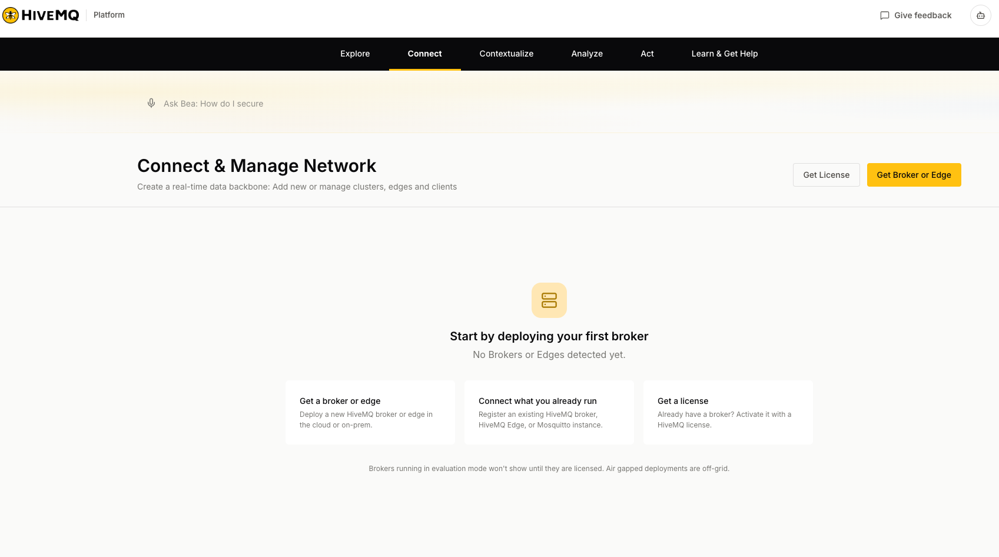

Choose **Deploy a new broker**, then **HiveMQ Cloud**, the option where HiveMQ hosts and manages it.

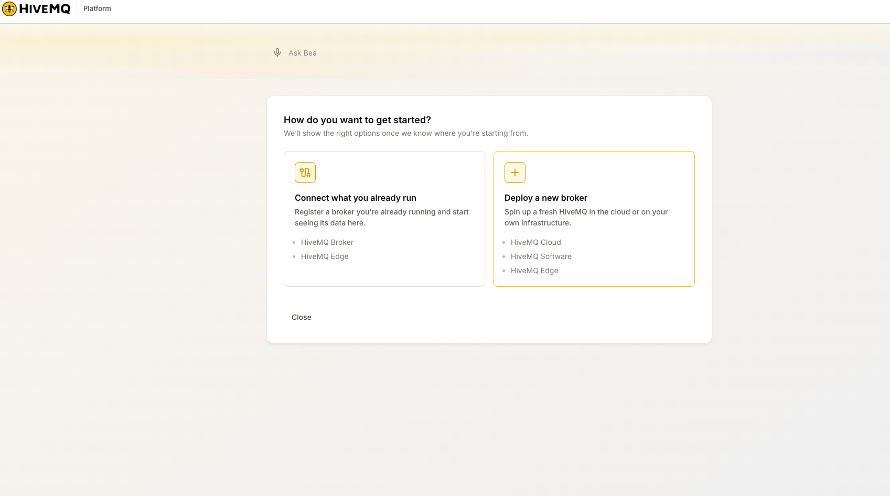

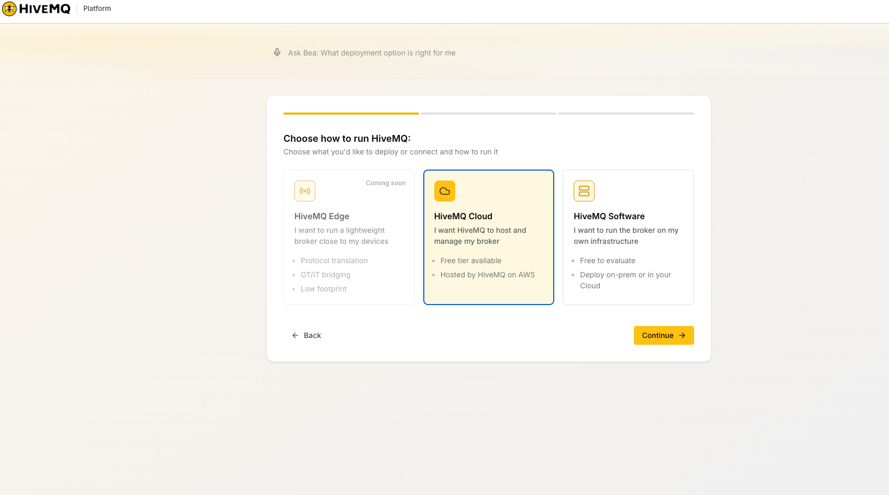
</Step>

<Step>
#### Pick the free Serverless plan

The Serverless plan is free, needs no credit card, and covers everything a room uses: MQTT 5, TLS, retained messages, and basic authorisation.

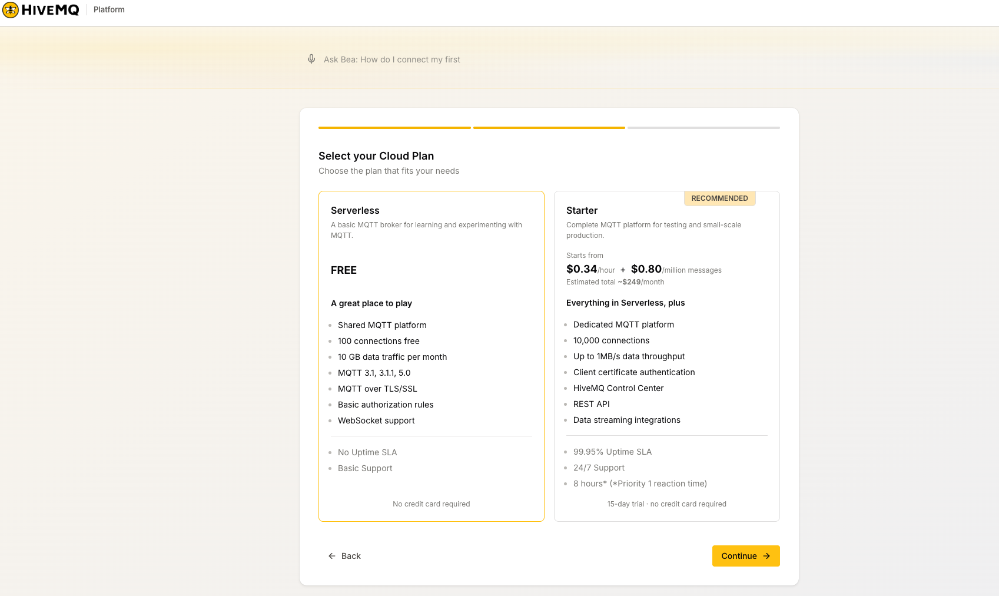

Confirm with **Create Serverless Broker**.

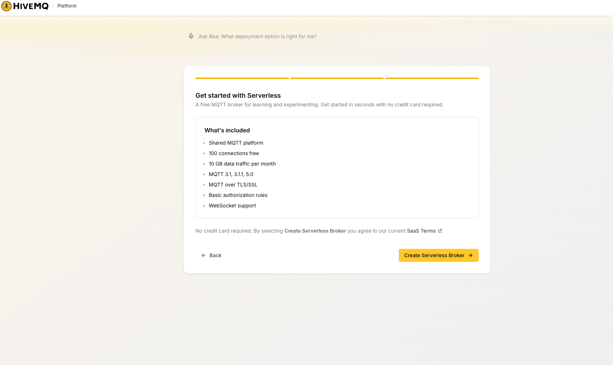

A few seconds later the broker shows as running.

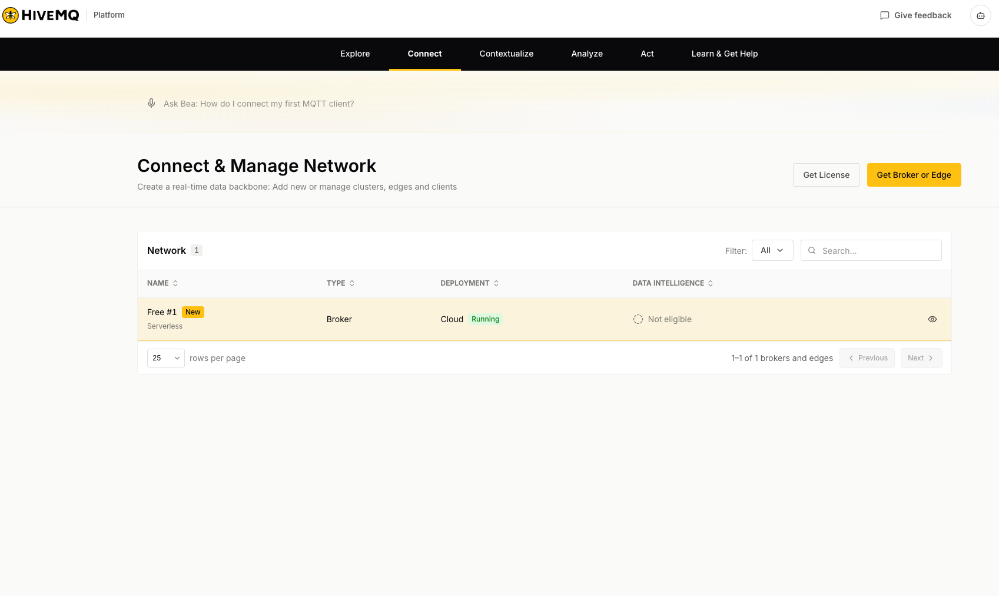

<Callout type="info">
The free tier's limits (100 connections, 10 GB of traffic a month) dwarf what a room uses. The room's whole state is a few hundred small retained messages, and live traffic is one message per edit.
</Callout>
</Step>

<Step>
#### Create the broker account

Open the broker and go to **Access Management**. A new broker has no credentials, and it refuses anonymous connections, so this step is not optional.

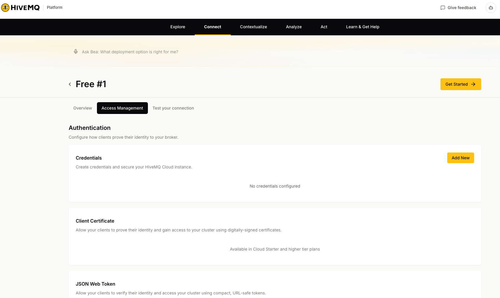

Pick **Add New**, choose a username, set Permission Type to **Publish and Subscribe**, and give it a strong password. This is the account the whole team shares, and only the room creator ever types it.

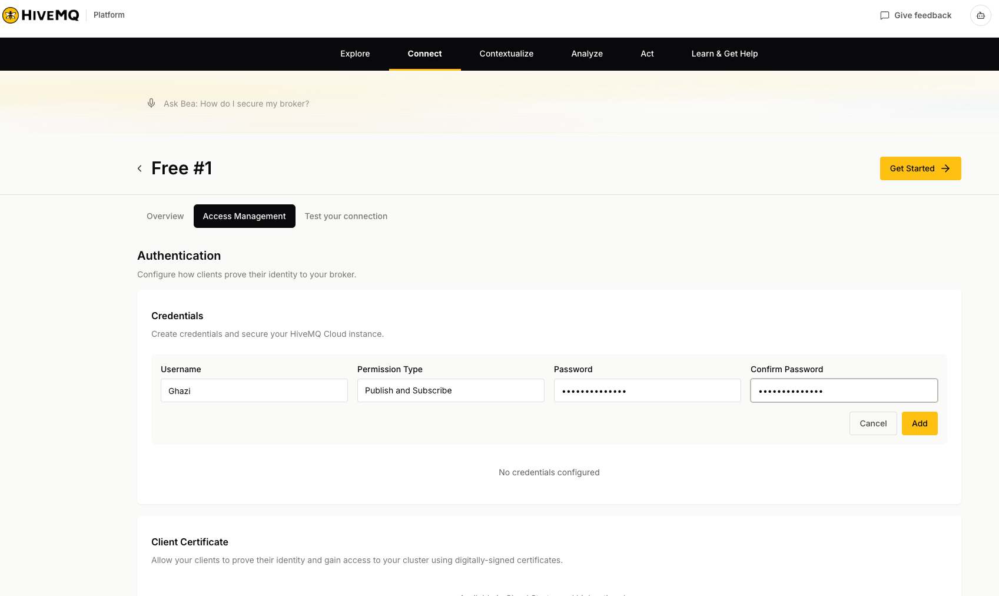

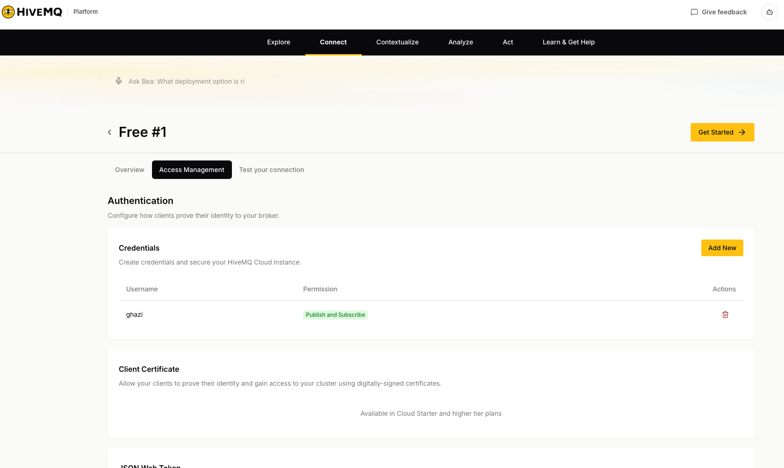
</Step>

<Step>
#### Copy the address

On the **Overview** tab, the address you want is the **TLS MQTT URL**, the one ending in `:8883`.

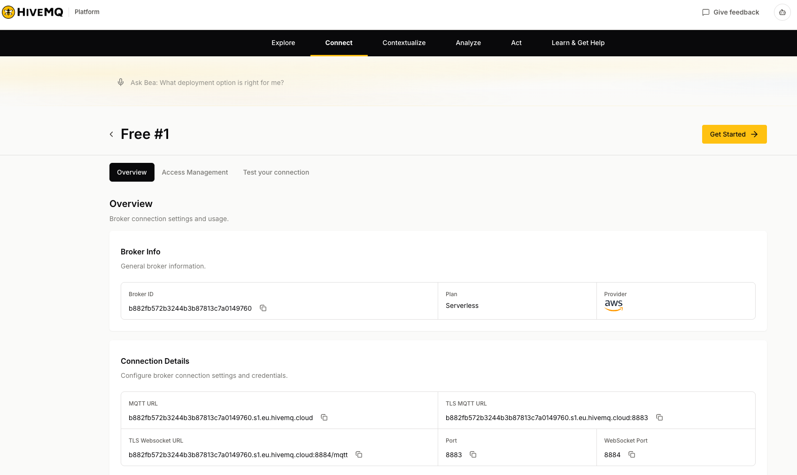

<Callout type="warn">
Notchboard takes it with `mqtts://` in front. Copy the TLS MQTT URL and prefix it, nothing else:

```
mqtts://YOUR-BROKER-ID.s1.eu.hivemq.cloud:8883
```

The username does not go in the address. The room setup dialog has its own field for it.
</Callout>

The plain MQTT URL is the unencrypted endpoint and Notchboard refuses it off localhost. The websocket URL is the corporate-firewall fallback, not the normal case.
</Step>
</Steps>

## Create the room

<Steps>
<Step>
#### Set up the team room

In Notchboard, open the ▾ menu next to the collection name and pick **set up team room**. Fill in, top to bottom: the `mqtts://` address from the previous step, a room name, the broker username and password you created in Access Management, and a room password (Generate sits next to it, and the password is never shown again, so copy it now).

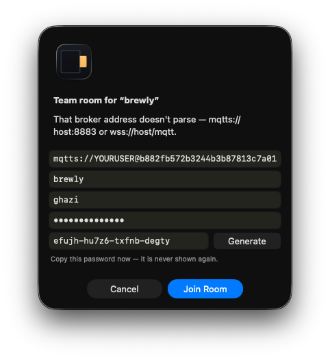

The address is validated as you fill it in, before anything connects.

The room connects as soon as it is created. The dot beside the wordmark goes green, the footer reads live, and the panel confirms the room by name.

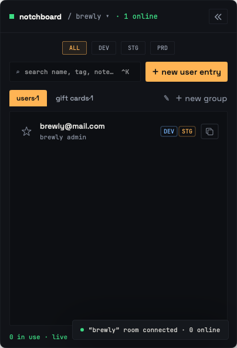
</Step>

<Step>
#### Copy the invite and share it

▾ menu, then **copy room invite**. Paste the invite line into your team chat, and send the room password another way, out of band.

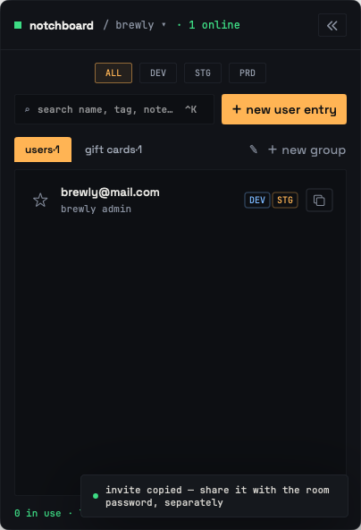
</Step>

<Step>
#### A teammate joins

They pick **join with an invite** from their ▾ menu, paste the invite, and type the room password. That is the whole join. The broker account travels inside the invite as ciphertext, so they never see or type it.

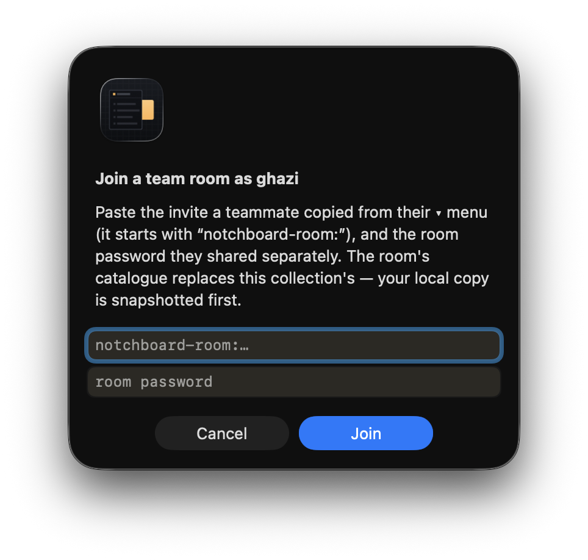

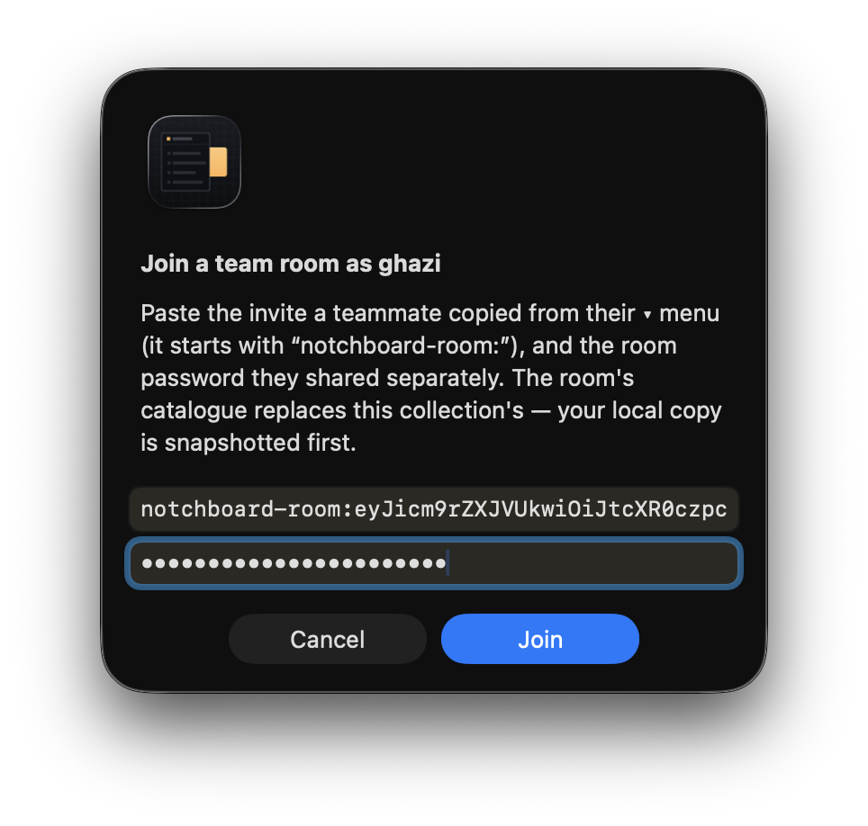

On first connect their collection adopts the room's catalogue, with their local copy snapshotted first. From here the room is live: every edit, deletion and in-use mark flows both ways as it happens, and the header counts who is online.

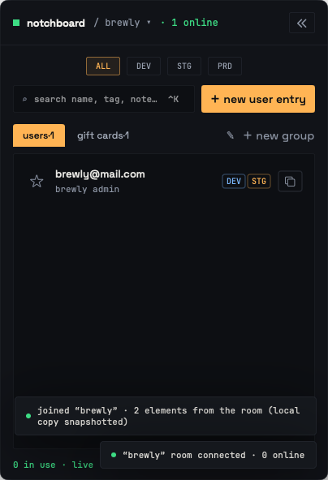
</Step>
</Steps>
