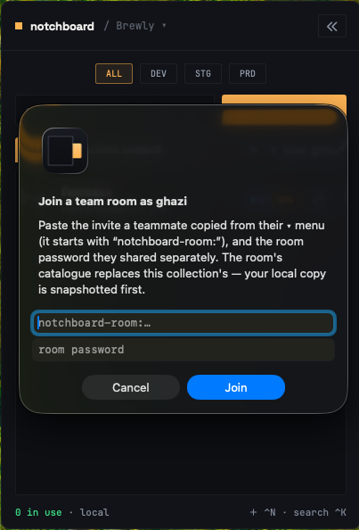
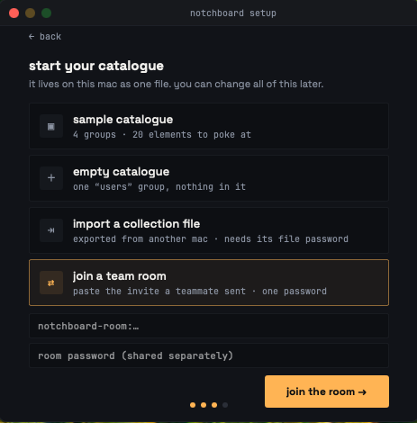

A room is how two or more Macs keep one collection in sync, live. Edits, schema changes, deletions and in-use marks flow both ways as they happen, with no polling and no refresh.

By default nothing leaves your Mac. A collection joins a room only when you tell it to.

<Callout type="success">
**There is no Notchboard server.** You bring your own MQTT broker, and it only ever relays ciphertext. The broker operator sees topic names, message sizes and timing, and nothing else.
</Callout>

## Before you start

You will need an MQTT 5 broker. A managed one such as HiveMQ Cloud or EMQX Cloud works, and so does your own mosquitto.

<details>

<summary>What your broker has to support</summary>

Notchboard leans on more of MQTT 5 than a chat app would, so "speaks MQTT" is not quite the bar.

* MQTT 5.0. There is no 3.1.1 fallback.
* Retained messages, and enough of them. The retained set is the room's entire state, one message per group, per element, per live in-use mark and per member.
* QoS 1, in both directions.
* Wildcard subscriptions, plus publish and subscribe permission on `nb/<room>/#`.
* The `noLocal` subscription option, and overlapping subscriptions kept distinct rather than merged.
* Last Will and Testament with retain, which is how a Mac that dies ungracefully stops holding its marks.
* The Message Expiry Interval property, used only to age out deletion records.

Mosquitto, HiveMQ and EMQX all qualify. A managed broker with a low retained-message quota or a restrictive topic ACL will fail in ways the app can only report as a generic connection problem.

</details>

<details>

<summary>A local mosquitto, for trying it out</summary>

```bash
brew install mosquitto
"$(brew --prefix)"/opt/mosquitto/sbin/mosquitto -p 1883
```

Then use `mqtt://localhost:1883`. TLS is not required on localhost and no broker account is needed. This is also what the integration tests expect.

</details>

### Broker addresses

Three forms are accepted, and anything else is refused at connect rather than silently downgraded.

| Form                             | Default port | When                                                         |
| -------------------------------- | :----------: | ------------------------------------------------------------ |
| `mqtts://[user@]host[:8883]`     |     8883     | The normal case, TLS over TCP                                |
| `wss://[user@]host[:443][/path]` |      443     | MQTT over WebSocket and TLS, the corporate-firewall fallback |
| `mqtt://localhost[:1883]`        |     1883     | Plaintext, loopback only, for a local mosquitto              |

A broker username rides inside the URL, as in `mqtts://team@broker.example:8883`. The broker password is typed separately in the setup dialog.

<Callout type="error">
Plaintext `mqtt://` to anything other than `localhost`, `127.0.0.1` or `::1` is refused. There is no flag to weaken it. Sending credentials over cleartext to a real host is exactly the mistake the refusal exists to prevent.
</Callout>

TLS trust comes from the system store and cannot be customised, so a self-hosted broker with a self-signed or private-CA certificate does not work.

## Hosting your own broker

A broker you run yourself is the strongest form of the privacy promise. The relay sees only ciphertext either way, but on your own machine even the topic names, message sizes and timing stay with you.

### On one Mac, to try it out

The local mosquitto above is the whole setup. No account, no TLS, no configuration file. It accepts connections from that Mac only, so it proves the room works rather than serving a team.

### For the team

Off localhost the app accepts `mqtts://` only, and the certificate has to be one macOS already trusts. In practice that means:

* The broker needs a real domain name and a certificate from a public CA such as Let's Encrypt. There is no override for a self-signed certificate.
* The machine does not have to be reachable from the internet. A DNS record pointing at a LAN address, with a certificate issued through a DNS-01 challenge, serves an office-only broker fine.

Mosquitto takes its settings from one plain-text file, read once at startup. These are file contents, not commands. Save them as `mosquitto.conf` (`"$(brew --prefix)"/etc/mosquitto/mosquitto.conf` on macOS, `/etc/mosquitto/conf.d/notchboard.conf` on Linux), with the certificate paths and domain replaced by your own. This minimal file meets everything in the requirements list above:

```
# mosquitto.conf, the settings file mosquitto reads when it starts up
listener 8883
certfile /etc/letsencrypt/live/broker.example.com/fullchain.pem
keyfile /etc/letsencrypt/live/broker.example.com/privkey.pem
password_file /etc/mosquitto/passwd
allow_anonymous false
persistence true
```

Create the account the team shares:

```bash
mosquitto_passwd -c /etc/mosquitto/passwd team
```

The broker address is then `mqtts://team@broker.example.com:8883`. Whoever creates the room types the account password once, and it reaches every joiner inside the invite, sealed under the room key.

Two lines in that configuration earn their place:

* `persistence true`, because the retained messages are the room's memory. Without it, a broker restart forgets the catalogue it was holding for the next joiner.
* `allow_anonymous false`, because anyone able to subscribe can collect ciphertext and grind the room password offline. The account is your outer wall.

No topic ACL is needed beyond the account. If you add one anyway, the account must be able to publish and subscribe on `nb/#`.


Any mosquitto a current package manager installs speaks MQTT 5. Without a configuration file, mosquitto listens on localhost only, which is why the try-it-out case needs nothing and the team case needs the file.


### A worked example: the CI Mac mini

A common shape: the team already keeps a Mac mini in the office as a self-hosted CI runner, and wants teammates anywhere in the world in the same room. The mini is a good fit. The room's entire state is a few hundred small retained messages and live traffic is one message per edit, so the broker is a rounding error next to a CI job.

On the mini:

```bash
brew install mosquitto
brew services start mosquitto
```

with the configuration above in `"$(brew --prefix)"/etc/mosquitto/mosquitto.conf`. A CI box is normally already set to never sleep, which is the other thing a broker needs.

To reach it from outside, two routes:

* Forward port 8883 on the router to the mini and point a domain at the office IP, with a dynamic-DNS updater if that IP can change. Everyone joins as `mqtts://team@broker.example.com:8883`. This is the proven route.
* No open ports at all: a Cloudflare Tunnel in front of a mosquitto WebSocket listener, joined as `wss://team@broker.example.com`. The tunnel's edge certificate is publicly trusted, so the system-store rule is satisfied. This route is supported but has not yet been exercised by a real team, so try it before the team depends on it.

The certificate is the part that needs care:

* Issue it with a DNS-01 challenge (certbot or lego against your DNS provider's API). That needs no inbound port 80, so it works behind NAT before any forwarding is set up.
* Automate renewal, and reload mosquitto in the renewal hook. A broker serving an expired certificate looks to every teammate like a dot that stays red, with nothing better to go on.
* Make sure the mosquitto process can read the renewed key file. Certbot's default directory layout is stricter than mosquitto's user.

Exposing 8883 to the internet is acceptable here because of what the broker holds: ciphertext under the room key, nothing else. The broker account is the outer wall that keeps strangers from collecting that ciphertext to grind the room password offline, so give the account a strong password. It is typed once and travels sealed inside invites anyway.

## Steps

<Steps>
<Step>
#### Create the room

One person does this, once. Open the ▾ menu next to the collection name and pick **set up team room**.

Fill in the broker address, a room name (lowercase letters, digits and dashes, such as `acme-mobile`), the broker username and password if your broker needs an account, and a room password. Generate sits beside the room password field.

The room name namespaces your topics on the broker, so pick something specific to your team.

<Callout type="warn">
Copy the room password now. It goes straight to the Keychain and is never displayed again.
</Callout>
</Step>

<Step>
#### Copy the invite

▾ menu → **copy room invite**. This puts one line on your clipboard:

```
notchboard-room:eyJicm9rZXJVUkwiOi…
```

It is base64url of the room config. Readable inside it: the broker address, the broker username, and the room name. Not readable: the broker account password, sealed under the room key. Not present at all: the room password.

The invite is a paste-code rather than a clickable URL on purpose. It needs no LaunchServices registration, survives being sent through chat or email, and cannot be triggered by a stray click.
</Step>

<Step>
#### Send the two pieces separately

Paste the invite line into your team chat. Send the room password another way, out of band, like a wifi password.

The invite on its own gives away only where the room is, not what is in it. Treat it like an internal link rather than a public one.
</Step>

<Step>
#### Join

Three doors, all the same flow. Paste the invite, type the room password.

* ▾ menu → **join with an invite**
* Menu bar → **Join Room with Invite**
* Onboarding → **join a team room** as your starting point



*The join dialog takes the pasted invite and the room password, nothing else.*



*Joining is also a starting point during setup, for a Mac with nothing to keep.*

The broker's retained messages then hand the new joiner the entire catalogue, with no history protocol of our own.
</Step>
</Steps>

<Callout type="error">
**Joining an existing room is destructive on first connect.** The room's catalogue replaces whatever that collection held locally, including its Keychain secrets, because the room is the source of truth once you are in it. A local snapshot is forced immediately before, and that snapshot is the only undo. Join with a fresh collection when you have anything you want to keep.
</Callout>

If the room is empty instead, your local catalogue seeds it.

## The room password is the only key

Everything published to the room is AES-GCM ciphertext under a key derived from the room password. Consequences worth knowing:

* Anyone with the room password can read the room. Anyone without it can read nothing, the broker operator included.
* A wrong room password is detected before anything is applied, so plausible garbage never reaches your catalogue.
* Removing someone means moving to a new room name. Rotating the password in place is refused, because everything the broker holds is retained ciphertext under the old key and nothing purges it. You would lock out the whole team, yourself included.

The room password is stored in the Keychain under service `flourix.notchboard.rooms`. The full reasoning is in the [security model](./security-model.mdx).

## What syncs and what does not

Syncs: element content (name, values including secrets, note, environments, last-used stamp), group schemas and their order, the collection name, deletions, and in-use marks.

Does not sync, deliberately:

* Favourites. Starring a row is personal.
* The notify-when-free watch list. Also personal, and in-memory only.
* Your deeplink scheme and every setting in Settings.
* Snapshots.

Conflicts resolve last-write-wins on the element, with the member id breaking exact ties deterministically on every Mac.

## Presence

Once connected, the panel header shows "· N online", counting you. The list footer carries the same count on the right. On the left it shows how many elements are in use, then the connection word: local, connecting, live, room offline, or room unreachable.

The connection dot is the amber square beside the wordmark, and the same dot on the notch when collapsed. Amber means local or connecting, green means live, red means the room is unreachable. It never animates.

An offline member's in-use marks render free, so a colleague who shut their laptop does not leave rows locked. Their mark is untouched and returns when they do. Closing the lid publishes a proper goodbye, so presence flips within a second or two rather than waiting out the 45 second keepalive.

Reconnection is automatic with exponential backoff from 1 to 60 seconds. You keep working locally the whole time, and everything you changed while offline is pushed on reconnect.

## Leaving

▾ menu → **leave room**, or Settings → Team room → Leave Room.

The collection keeps everything it has and stops sending and receiving. The room password is deleted from this Mac's Keychain, so rejoining means pasting the invite and the password again.

## Honest rough edges

Documented rather than hidden.

<details>

<summary>A mark released while offline comes back briefly</summary>

It is reinstated by its own retained copy on reconnect, then ages out through the auto-release sweep. A mark is a status light, and a minute of staleness beat adding a special case to the protocol.

</details>

<details>

<summary>Deletion records expire after 30 days</summary>

A Mac that was offline longer than that can resurrect a deleted row.

</details>

<details>

<summary>Simultaneous edits lose one side</summary>

Two people editing the same element within the same instant means one edit is silently dropped. Last-write-wins is the accepted trade here.

</details>

<details>

<summary>Restoring a snapshot leaves stale sessions</summary>

Restoring does not tear down sessions for collections the restore removed. They go on the next relaunch. Deleting a collection handles it properly.

</details>

## Troubleshooting

<details>

<summary>The dot stays red</summary>

Check the broker address form first. A plaintext `mqtt://` pointed at a real host is refused by design, with a message telling you to use `mqtts://`.

If the address is right, the broker is the next suspect. A restrictive topic ACL that blocks `nb/<room>/#`, or a retained-message quota, surfaces only as a generic connection problem.

</details>

<details>

<summary>Joining fails immediately, before any connection attempt</summary>

That is a wrong room password, detected with certainty. The broker account password inside the invite is sealed under the room key, so a seal that will not open proves the password is wrong without a round trip.

</details>

<details>

<summary>A teammate's rows all show as free</summary>

They are offline. An offline member's marks render free so their shut laptop does not leave rows locked. The marks themselves are untouched and return when they do.

</details>
