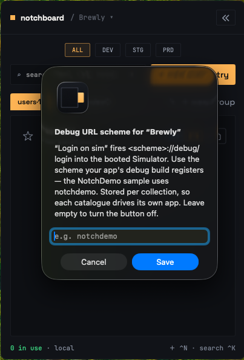

**login on sim** fires a URL into the booted simulator so your app logs itself in. It runs:

```bash
xcrun simctl openurl booted "<scheme>://debug/login?user=…&pass=…"
```

Docked to an Android emulator, the same button goes through `adb` instead. The login follows the dock; with neither docked it targets whichever platform is running, iOS on a tie:

```bash
adb -s emulator-<port> shell am start -a android.intent.action.VIEW -d "'<scheme>://debug/login?user=…&pass=…'"
```

The username comes from the element's `username` field. The password comes from the group's first secret-typed field, read from memory, so the real value and not the on-disk placeholder.

Both are percent-encoded aggressively, against alphanumerics only, so an email's `@` and `+` and every punctuation character a generated password can carry survive the trip.

## Before you start

One thing decides whether the button appears at all: the element needs a non-empty field keyed `username`. If the group has no secret field, or that field is empty on this element, the URL carries only `user=`.

## Steps

<Steps>
<Step>
#### Set the scheme on the collection

The scheme is per collection, because each catalogue describes one app. Two places to set it:

* The ▾ menu next to the collection name. The item reads **set deeplink scheme** while there is none, and shows the scheme once one is set.
* Settings → Debug deeplink → Debug URL scheme.



*The scheme is stored per collection, so each catalogue drives its own app.*

`mythos`, `mythos:`, `mythos.` and `mythos://` all normalise to `mythos`.

<Callout type="warn">
Network schemes (`http`, `https`, `ftp`, `file`, `ws`, `wss`) are refused, so pasting your app's universal link can never fire credentials at a live host as query parameters.
</Callout>

The scheme is checked when you press the button, not when it is drawn. Without one, the button still appears, captioned "no URL scheme yet", and pressing it tells you where to set it.
</Step>

<Step>
#### Register the scheme in your debug build

On iOS, add the URL scheme to the debug build's `Info.plist` — `SampleApp/README.md` in the repository has the full block. On Android, add an intent filter for the scheme to the debug manifest — `SampleApp/NotchDemoAndroid/README.md` has that one.
</Step>

<Step>
#### Handle the route

Two pieces, and nothing else:

<Tabs items={['iOS', 'Android']}>
  <Tab value="iOS">
    ```swift
    .onOpenURL { url in
        guard let components = URLComponents(url: url, resolvingAgainstBaseURL: false),
              components.host == "debug", components.path == "/login",
              let user = components.queryItems?.first(where: { $0.name == "user" })?.value
        else { return }
        let pass = components.queryItems?.first(where: { $0.name == "pass" })?.value
        // fill your login form and submit
    }
    ```
  </Tab>

  <Tab value="Android">
    ```java
    Uri url = intent.getData();
    if (url != null && "debug".equals(url.getHost()) && "/login".equals(url.getPath())) {
        String user = url.getQueryParameter("user");
        String pass = url.getQueryParameter("pass");
        // fill your login form and submit
    }
    ```

    Give the activity `android:launchMode="singleTop"` and handle `onNewIntent` too, or every login stacks a fresh activity instead of switching accounts in place.
  </Tab>
</Tabs>
</Step>

<Step>
#### Try it

Open an element and press **login on sim**.

If the deeplink succeeds and the element was free, it is marked in use automatically. Logging in as an account is using it. If `simctl` or `adb` fails, nothing is marked.
</Step>
</Steps>

<Callout type="info">
`SampleApp/NotchDemo` in the repository is a runnable reference integration, with `SampleApp/NotchDemoAndroid` as its Android twin. Install one into a simulator or emulator to try the bridge before touching your own project.
</Callout>

## When to use copy password instead

Some logins a deeplink cannot drive. SSO redirects, Okta, anything rendered in a WebView, any flow where your app never receives the URL.

For those, use **use + copy** for the username and **copy password** for the password, then paste them by hand. You still get the in-use mark, so teammates still see the account is taken.

## Accepted exposures

`simctl` and `adb` both take the URL as a command-line argument, so while that short-lived process runs the password is readable in the process list by other processes running as you. There is no argv-free way to hand either tool a URL.

These are shared test credentials on a local developer tool, so the trade-off is accepted and documented rather than hidden. Everything under Notchboard's own control, its log lines and the tools' echoed output, is redacted.

Android adds one exposure of its own: emulators on API 32 and older log the intent's URL verbatim to logcat, credentials included. API 33 and later redact it. If your test devices run old images, know that the logcat buffer holds those logins.

## Troubleshooting

<details>

<summary>iOS asks "Open in \?" every time</summary>

It asks once per simulator install, not once per login. Accept it and it stops.

</details>

<details>

<summary>The button is not there</summary>

The element has no value in a field keyed `username`. The button is hidden rather than disabled in that case.

</details>

<details>

<summary>Firing while already signed in does nothing</summary>

Re-firing swaps accounts only if your handler resets the session first. That is your app's job, not Notchboard's.

</details>

<details>

<summary>Nothing happens on the Android emulator</summary>

Two usual suspects. `adb` is not installed — it comes with Android's platform-tools, and Notchboard looks for it in `$ANDROID_HOME`, `$ANDROID_SDK_ROOT`, `~/Library/Android/sdk` and the Homebrew locations. Or the app in the emulator does not register the scheme — install `SampleApp/NotchDemoAndroid` and try against that first.

</details>
